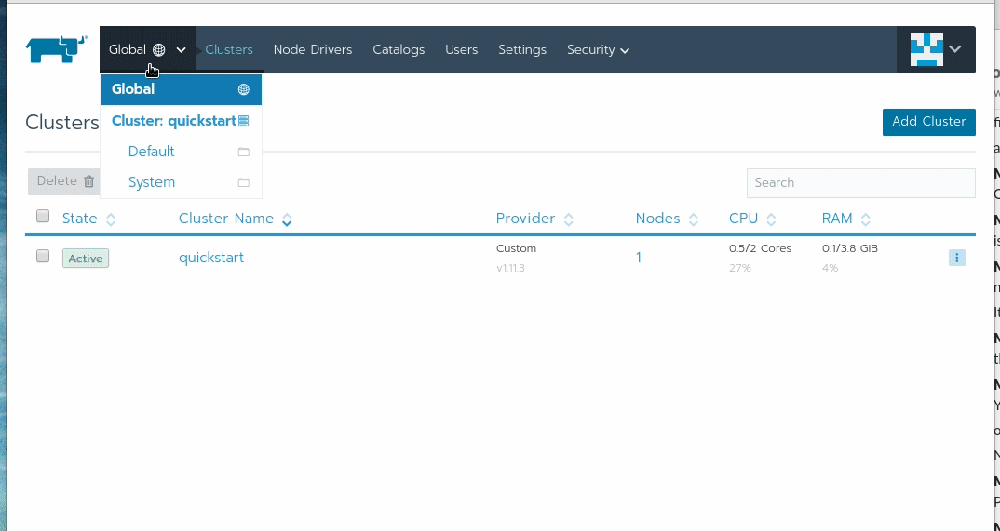

### Jenkins deployment with Rancher 2 ###

Making Jenkins work with rancher 2.0 is fairly staightforward process. We need to clone

git clone https://github.com/rancher/quickstart

cd quickstart/aws


mv terraform.tfvars.example terraform.tfvars


change the variables accordingly 

```
tarraform init

terraform apply
```




``` kubectl get pod
 NAME                       READY     STATUS    RESTARTS   AGE
 jenkins-7d97547648-drps7   1/1       Running   0          49m 
```


```
kubectl exec jenkins-7d97547648-drps7 cat /var/jenkins_home/secrets/initialAdminPassword
9128cffec397498a81ec998a26513c57
```
