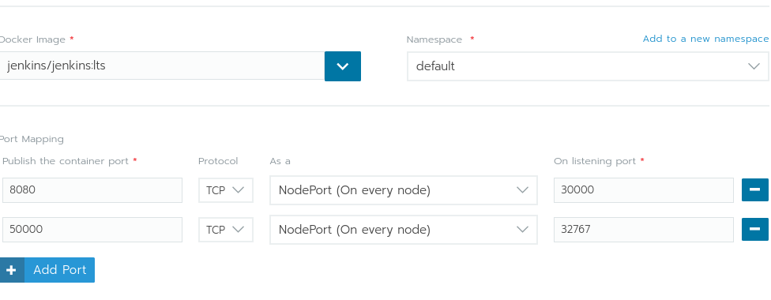

### Jenkins deployment with Rancher 2 ###

Making Jenkins work with rancher 2.0 is fairly staightforward process. We need to clone quickstart repository 

```git clone https://github.com/rancher/quickstart```

change dir into it 

```
cd quickstart/aws
```

We need to use example tfwars as a template
```mv terraform.tfvars.example terraform.tfvars```


change the variables accordingly 
```
nano terraform.tfvars
```


```
tarraform init

terraform apply
```
The terraform apply command will give output similar to this 
```
Outputs:

rancher-url = [
    https://54.188.5.4
]
```

There you will need to enter admin password with is "admin" if you did not change it in tfvars file. 


Next we need to make a deployment for the Jenkins. We use docker image jenkins/jenkins:lts and we open the needed ports. As we stared with one node cluster, NodePort will be combination of node ip and randomized port we will see in the UI, like in image bellow. 




When we direct the browser to the mentioned socket, we will be greeted with jenkins interface asking for password. To get the randomized password, we will need to go in Rancher UI to Cluster >> quickstart (this is name of the cluster) and then launch kubectl in top right corner. There we need to see name of the pod


```
 kubectl get pod
 NAME                       READY     STATUS    RESTARTS   AGE
 jenkins-7d97547648-drps7   1/1       Running   0          49m 

```


```
kubectl exec jenkins-7d97547648-drps7 cat /var/jenkins_home/secrets/initialAdminPassword
9128cffec397498a81ec998a26513c57
```

This is the initial password you can enter in the jenkins prompt to start installation. 
